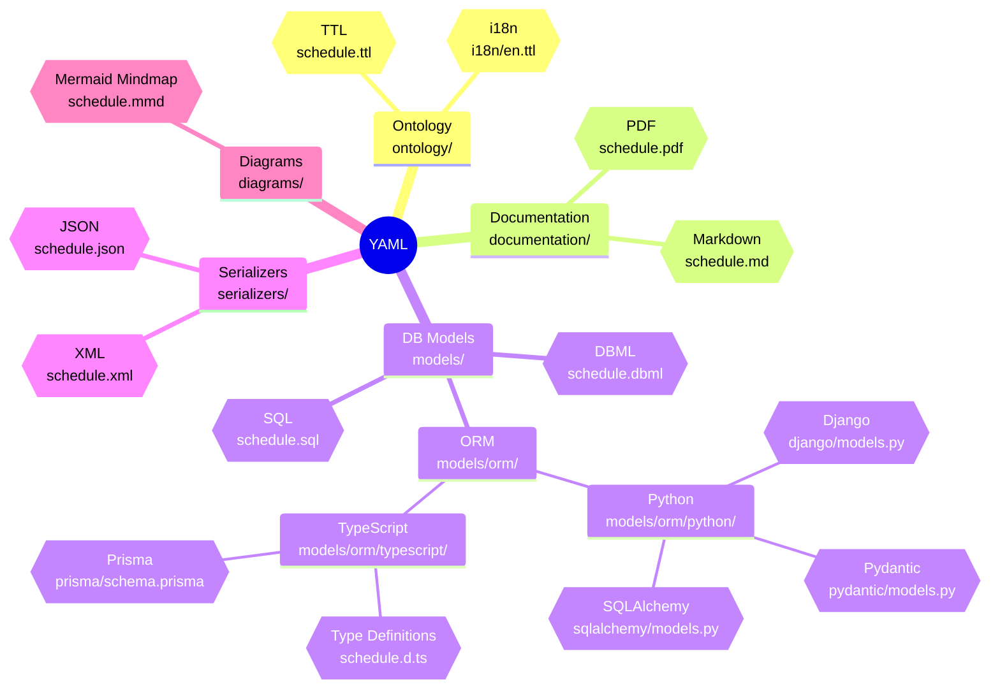

# GTFS Schedule Reference Generator

This project uses a single YAML source-of-truth to generate and share the GTFS Schedule reference across multiple formats. The YAML drives automated outputs for ontology, documentation, database models, serializers, and diagrams.

## Overview

- **YAML Ground Truth**: Canonical reference for GTFS Schedule.
- **Generated Outputs (planned)**: TTL, Markdown, PDF, DBML, SQL, Django ORM, Pydantic Types, SQLAlchemy ORM, TypeScript Type Definitions, Prisma ORM, JSON, XML, and Mermaid.
- **Validation**: JSON Schema for structure; ontology with SHACL shapes for semantic constraints.

## Conversion Overview



## Outputs & Locations

- **Ontology (TTL)**:
  - ontology/schedule.ttl
  - multilingual overlays in ontology/i18n/en.ttl, es.ttl, pt.ttl.
- **Docs (MD/PDF)**:
  - documentation/schedule.md
  - documentation/schedule.pdf
- **DB Models**:
  - DBML: models/schedule.dbml
  - SQL: models/sql/schedule.sql
  - Django ORM: models/orm/python/django/models.py
  - Pydantic Types: models/orm/python/pydantic/models.py
  - SQLAlchemy ORM: models/orm/python/sqlalchemy/models.py
  - TypeScript Types: models/orm/typescript/schedule.d.ts
  - Prisma ORM: models/orm/typescript/prisma/schema.prisma
- **Serializers**:
  - JSON: serializers/schedule.json
  - XML: serializers/schedule.xml
- **Diagrams**:
  - Mermaid: diagrams/schedule.mmd.

## Project Structure

```
├── diagrams/
│   └── schedule.mmd
├── documentation/
│   ├── realtime.md
│   └── schedule.md
├── models/
│   ├── schedule.sql
│   ├── schedule.dbml
│   └── orm/
│       ├── python/
│       │   ├── django/
│       │   │   └── models.py
│       │   ├── pydantic/
│       │   │   └── models.py
│       │   └── sqlalchemy/
│       │       └── models.py
│       └── typescript/
│           ├── schedule.d.ts
│           └── prisma/
│               └── schema.prisma
├── ontology/
│   ├── schedule.ttl
│   └── i18n/
│       ├── en.ttl
│       ├── es.ttl
│       └── pt.ttl
├── reference/
│   ├── realtime.md
│   └── schedule.md
├── serializers/
│   ├── schedule.xml
│   ├── schedule.json
│   ├── schedule.schema.json
│   └── schedule.yaml
├── LICENSE
├── main.py
├── pyproject.toml
└── README.md
```

## Usage

### View & Convert YAML to JSON

```bash
# View the YAML ground truth
cat serializers/schedule.yaml

# Convert YAML to JSON
uv run ./converters/yaml2json.py

# Validate JSON against the schema (requires a validator)
npm install -g ajv-cli
ajv validate -s serializers/schedule.schema.json -d serializers/schedule.json
```

### Generate Other Artifacts

Artifact generation is orchestrated by dedicated scripts/tools per target (ORMs, docs, diagrams). Where applicable, outputs are written to the paths listed above. Refer to each generator’s instructions and `pyproject.toml` tasks if defined.

## Ontology Namespace

- **Prefix**: gtfs
- **URI**: http://ontology.gtfs.org/reference#

```turtle
@prefix gtfs: <http://ontology.gtfs.org/reference#> .
```

## Contributing

- Extend `serializers/schedule.yaml` to enrich the source reference.
- Keep `serializers/schedule.schema.json` aligned with structural changes.
- Add/adjust generators to produce new formats (e.g., Prisma, XML, PDF) into the paths above.
- For ontology i18n, add new overlays in ontology/i18n/ and ensure labels/comments use correct language tags.

## Status

The YAML-driven pipeline is actively expanding. Outputs listed above reflect the current set and planned locations where some artifacts are generated or expected.
